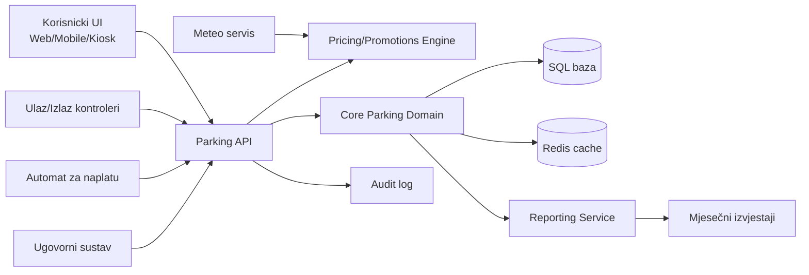
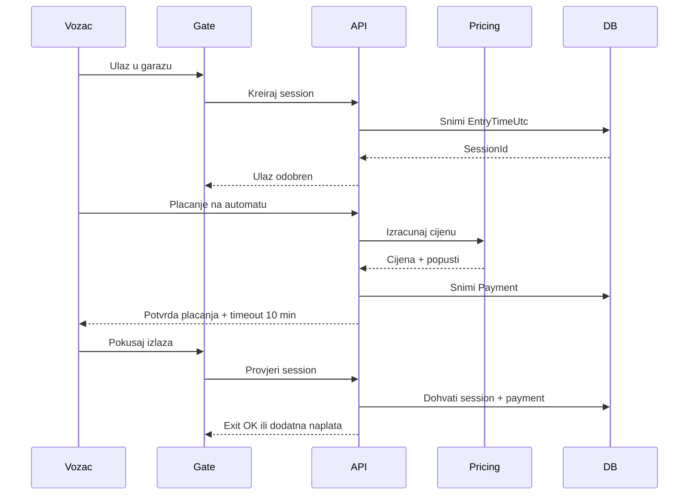

# Zadatak 2 - Analiza zahtjeva i arhitektura rjesenja

## 1. Sažetak zahtjeva
Sustav treba voditi naplatu parkiralista po vremenu zauzetosti mjesta, prikazivati broj slobodnih mjesta (globalno i po katu), podrzati ugovorne korisnike i osigurati mjesecne poslovne izvjestaje. Klijent zahtijeva visok stupanj pouzdanosti naplate i identifikaciju korisnika.

## 2. Ključni dijelovi sustava
- Upravljanje kapacitetima: mjesta, katovi, status zauzetosti.
- Evidencija ulaska/izlaska: vrijeme ulaska, vrijeme izlaska, timeout pravilo 10 minuta nakon placanja.
- Naplata: obracun po vremenu i tipu mjesta (natkriveno/nenatkriveno), plus ugovorni model.
- Promocije i cijene: kisa popust za nenatkrivena mjesta prema pravilu 33% vremena na kisi.
- Izvjestavanje: mjesecni KPI (prihod, popunjenost, isplativost akcije).
- Identitet korisnika: autentikacija/identifikacija korisnika i audit dogadaja.

## 3. Ključni procesi
- Ulaz vozila: izdavanje parkirnog tokena i dodjela mjesta.
- Boravak: praćenje trajanja i vremenskih uvjeta (za kisni popust).
- Placanje: na automatu ili kroz ugovor, prije izlaza.
- Izlaz: validacija da je placeno i da nije istekao grace period 10 minuta.
- Nakon isteka grace perioda: dodatna naplata prije izlaza.
- Mjesecni obračun i reporti.

## 4. Potencijalni problemi i rizici
- Kritican rizik: greska naplate (najveci poslovni rizik).
- Race condition na ulazu/izlazu kod zadnjih slobodnih mjesta.
- Nedovoljna sinkronizacija vremenskih podataka (UTC obavezno).
- Pogresna primjena kisnog popusta ako nema tocnog vremenskog feeda.
- Ugovorni korisnici i ad-hoc korisnici moraju imati jasno odvojene tokove naplate.
- Nedorecen nacin oznacavanja ulaska (kartica, kamera, QR, tablice) treba finalnu odluku.

## 5. Predlozena arhitektura (big picture)



## 6. Idejni nacrt baze

### Osnovne tablice
- Garage
  - Id, Name, TotalCapacity
- Floor
  - Id, GarageId, Name, Level, Capacity
- ParkingSpot
  - Id, FloorId, SpotCode, IsCovered, IsActive
- VehicleSession
  - Id, SpotId, EntryTimeUtc, ExitTimeUtc, TicketId, UserId, Status
- Payment
  - Id, SessionId, PaidAtUtc, Amount, Method, IsContractSettlement
- PricingRule
  - Id, Name, RuleType, IsActive, ParametersJson
- WeatherObservation
  - Id, ObservedAtUtc, IsRaining, Source
- UserAccount
  - Id, IdentityProviderId, UserType, ContractId, IsActive
- Contract
  - Id, PartnerName, BillingModel, StartDateUtc, EndDateUtc, IsActive
- MonthlyReport
  - Id, Month, Year, GeneratedAtUtc, PayloadJson
- AuditEvent
  - Id, OccurredAtUtc, ActorId, EventType, PayloadJson

### Ključne relacije
- Garage 1:N Floor
- Floor 1:N ParkingSpot
- ParkingSpot 1:N VehicleSession
- VehicleSession 1:N Payment
- UserAccount 0..N:1 Contract

## 7. Ključni dijagram procesa naplate



## 8. Pseudokod ključnih procesa

### 8.1 Obracun cijene
```text
function calculatePrice(session):
    duration = ceilToBillingUnit(session.entry, now)
    baseRate = rateBySpotType(session.spotType)
    amount = duration * baseRate

    rainCoverage = getRainCoverage(session.entry, now)
    if session.spotType == UNCOVERED and rainCoverage >= 0.33:
        amount = amount * 0.5

    return roundCurrency(amount)
```

### 8.2 Izlaz iz garaže
```text
function canExit(session):
    if not session.isPaid:
        return DENY_PAY_REQUIRED

    graceDeadline = session.paidAt + 10 minutes
    if now <= graceDeadline:
        return ALLOW

    extraAmount = calculateAdditionalAmount(graceDeadline, now, session.spotType)
    return DENY_EXTRA_PAYMENT_REQUIRED(extraAmount)
```

### 8.3 Broj slobodnih mjesta
```text
function getAvailability(garageId):
    totalFree = count(spots where isActive and not occupied)
    byFloor = groupCountByFloor(spots where isActive and not occupied)
    return { totalFree, byFloor }
```

## 9. Nefunkcionalni zahtjevi
- Pouzdanost naplate: transakcijski sigurni upisi i idempotentni payment API.
- Performanse: cache za availability i precomputed agregati za dashboard.
- Sigurnost: autentikacija, autorizacija, audit, enkripcija osjetljivih podataka.
- Observability: centralizirani logovi, metriike, alerting za naplatu i gate failure.

## 10. Otvorena pitanja za klijenta
- Konacni mehanizam identifikacije ulaza/izlaza (kartica, ANPR, QR).
- Detaljan model ugovornih korisnika (flat fee, limit, SLA).
- Pravila za buduce promocije i prioritet pravila.
- Pravila fallbacka kada meteo servis nije dostupan.
